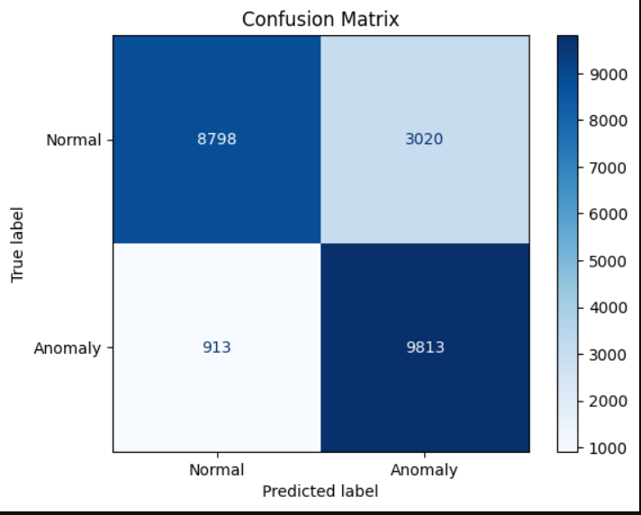

# Network Intrusion Detection on NSL-KDD Dataset using AutoEncoder

## Task description

This project explores the NSL-KDD dataset to build and evaluate an Autoencoder-based model for network intrusion detection. The Autoencoder, a neural network architecture, is trained on normal network connections to learn their patterns. Anomalies, such as network attacks, are detected by identifying instances with high reconstruction errors. Through this, we assess the effectiveness of a deep learning model in handling tabular data for anomaly detection. This notebook provides a step-by-step guide to data exploration, preprocessing, model implementation, and performance evaluation.

## Initial Results (Without Hyperparameter Tuning)

## Summary
- **Actual Intrusions**: 12,833
- **Detected Intrusions**: 10,726

## Confusion Matrix
|                | Predicted Positive | Predicted Negative |
|----------------|--------------------|-------------------|
| **Actual Positive** | 8,798 (TP)         | 913 (FN)          |
| **Actual Negative** | 3,020 (FP)         | 9,813 (TN)        |

## Performance Metrics
- **Precision**: 0.9149
- **Recall**: 0.7647
- **F1-Score**: 0.8331
- **ROC AUC**: 0.9165

